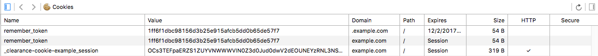

# Clearance Cookie Example

Small example app to demonstrate how clearance creates two cookies when used with ``cookie_domain`` option.

See issue #616.

## Steps to reproduce

1. set ``127.0.0.1 example.com`` in ``/etc/hosts``
2. start ``rails server``
3. visits ``http://example.com:3000``
4. sign up and sign in
5. open browser inspector to see two different cookies named ``remember_token``
6. sign out
7. see how only one cookie got removed. The other one sticks around causing some potential issues.

